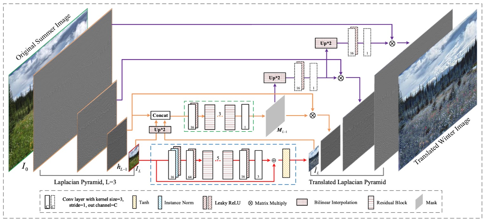

# LPTN

### [Paper](https://arxiv.org/pdf/2105.09188.pdf) |   [Supplementary Material](http://www4.comp.polyu.edu.hk/~cslzhang/paper/LPTN-cvpr21-supp.pdf) |   [Poster](http://liangjie.xyz/LjHomepageFiles/paper_files/poster_LPTN.pdf)

> **High-Resolution Photorealistic Image Translation in Real-Time: A Laplacian Pyramid Translation Network** <br>
> Jie Liang\*, Hui Zeng\*, and [Lei Zhang](https://www4.comp.polyu.edu.hk/~cslzhang/). <br>
> In CVPR 2021.

### Abstract

Existing image-to-image translation (I2IT) methods are either constrained to low-resolution images or long inference time 
due to their heavy computational burden on the convolution of high-resolution feature maps. 
In this paper, we focus on speeding-up the high-resolution photorealistic I2IT tasks 
based on closed-form Laplacian pyramid decomposition and reconstruction. 
Specifically, we reveal that the attribute transformations, such as illumination and color manipulation, 
relate more to the low-frequency component, while the content details can be adaptively refined on high-frequency components. 
We consequently propose a Laplacian Pyramid Translation Network (LPTN) to simultaneously perform these two tasks, 
where we design a lightweight network for translating the low-frequency component with reduced resolution 
and a progressive masking strategy to efficiently refine the high-frequency ones. 
Our model avoids most of the heavy computation consumed by processing high-resolution feature maps 
and faithfully preserves the image details. Extensive experimental results on various tasks demonstrate that 
the proposed method can translate 4K images in real-time using one normal GPU 
while achieving comparable transformation performance against existing methods.

Overall pipeline of the LPTN:



For more details, please refer to our paper.

#### Getting started

- Clone this repo.
```bash
git clone https://github.com/csjliang/LPTN
cd LPTN
```

- Install dependencies. (Python 3 + NVIDIA GPU + CUDA. Recommend to use Anaconda)
```bash
pip install -r requirement.txt
```

- Download dataset (FiveK in 480p) and create lmdb (to accelerate training).
```bash
PYTHONPATH="./:${PYTHONPATH}" python scripts/data_preparation/download_datasets.py
PYTHONPATH="./:${PYTHONPATH}" python scripts/data_preparation/create_lmdb.py
```

Users can also download the dataset [HERE](https://drive.google.com/file/d/1oAORKd-TPnPwZvhcnEEJqc1ogT7KgFtx/view?usp=sharing).

#### Training

First, check and adapt the yml file ```options/train/LPTN/train_FiveK.yml```, then

- Single GPU:
```bash
PYTHONPATH="./:${PYTHONPATH}" CUDA_VISIBLE_DEVICES=0 python codes/train.py -opt options/train/LPTN/train_FiveK.yml
```

- Distributed Training:
```bash
PYTHONPATH="./:${PYTHONPATH}" CUDA_VISIBLE_DEVICES=0,1,2,3 python -m torch.distributed.launch --nproc_per_node=4 --master_port=4321 codes/train.py -opt options/train/LPTN/train_FiveK.yml --launcher pytorch
```

Training files (logs, models, training states and visualizations) will be saved in the directory ```./experiments/{name}```

#### Evaluation

First, check and adapt the yml file ```options/test/LPTN/test_FiveK.yml``` and ```options/test/LPTN/test_speed_FiveK.yml```, then

- Calculate metrics and save visual results:
```bash
PYTHONPATH="./:${PYTHONPATH}" CUDA_VISIBLE_DEVICES=0 python codes/test.py -opt options/test/LPTN/test_FiveK.yml
```

- Test inference speed:
```bash
PYTHONPATH="./:${PYTHONPATH}" CUDA_VISIBLE_DEVICES=0 python codes/test_speed.py -opt options/test/LPTN/test_speed_FiveK.yml
```

Evaluating files (logs and visualizations) will be saved in the directory ```./results/{name}```

#### Use Pretrained Models

- Download the pretrained model from [GoogleDrive](https://drive.google.com/file/d/11yuFgHqZe9e4OheJ9YHp9lS-4kQC1Fml/view?usp=sharing) and move it to the directory ```experiments/pretrained_models```:

- Specify the ```path: pretrain_network_g``` in ```test_FiveK.yml``` and run evaluation.

### Notes

- We have optimized the training process and improved the performance (get 22.9db on FiveK at 480p)

- We will release the datasets of day2night and sum2win later. (Note: Please send me an email to access the data, and use the data for research purposes only. Thanks!)

### Citation
If you use this dataset or code for your research, please cite our paper.
```
@inproceedings{jie2021LPTN,
  title={High-Resolution Photorealistic Image Translation in Real-Time: A Laplacian Pyramid Translation Network},
  author={Liang, Jie and Zeng, Hui and Zhang, Lei},
  booktitle={Proceedings of the IEEE Conference on Computer Vision and Pattern Recognition},
  year={2021}
}
```

### Acknowledgement
We borrowed the training and validating framework from the excellent [BasicSR](https://github.com/xinntao/BasicSR) project.


### Contact
Should you have any questions, please contact me via `liang27jie@gmail.com`.
